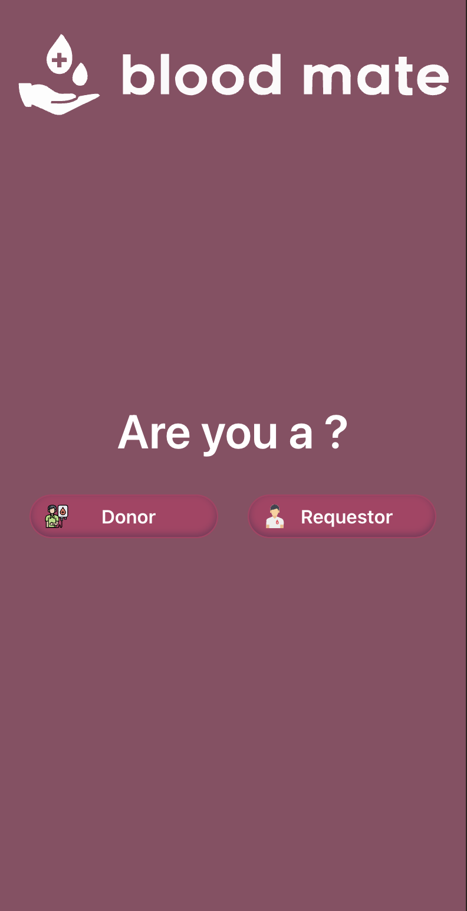
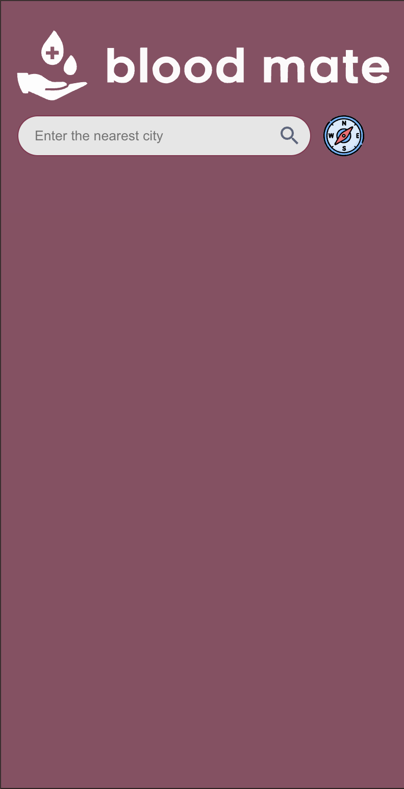
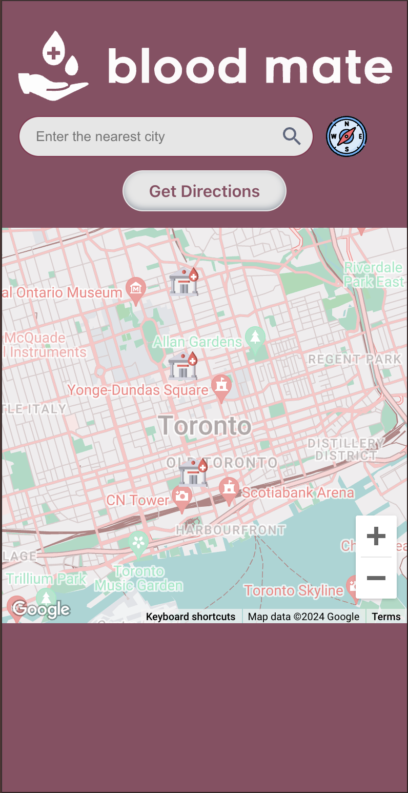
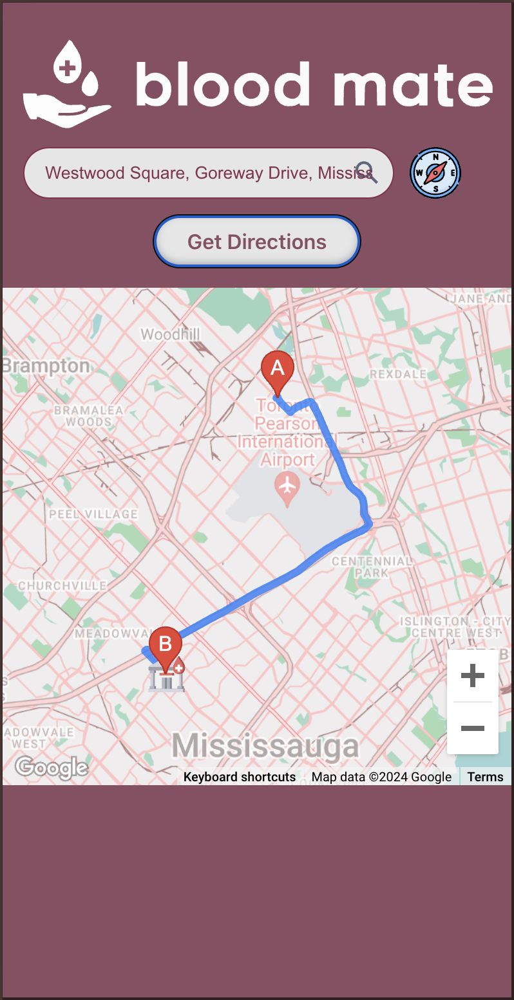
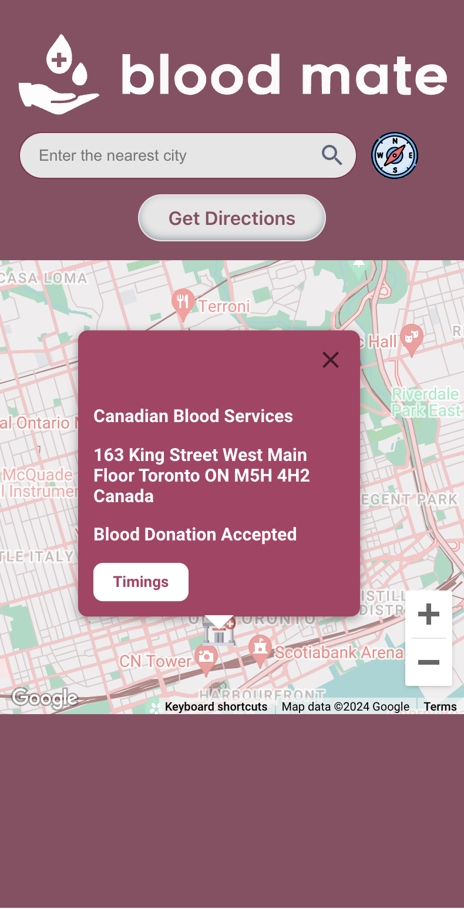
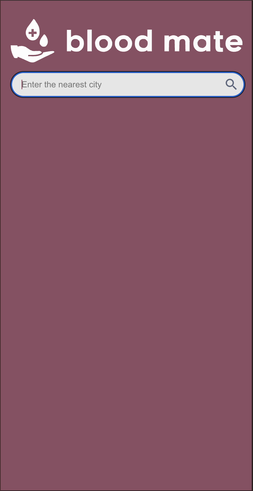
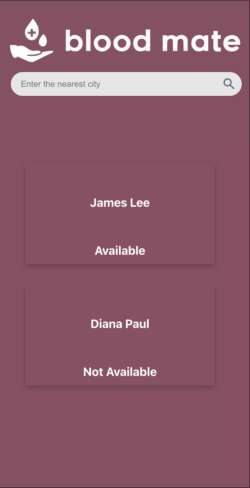
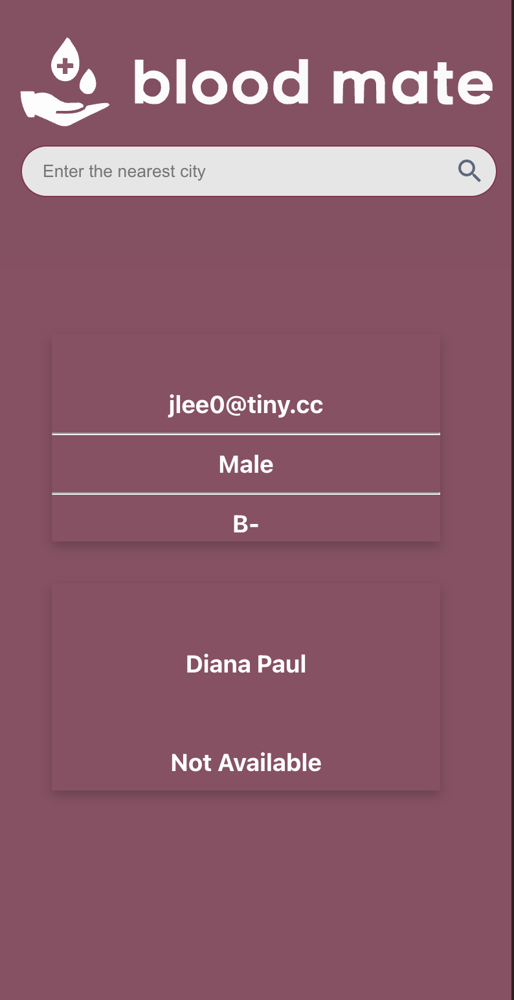
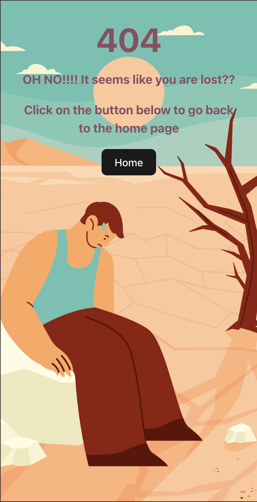

# Project Title

## Overview

What is your app? Brief description in a couple of sentences.
Blood Bank Management System:
Create a streamlined and efficient process to facilate secure and organized management of blood donations

### Problem

Why is your app needed? Background information around any pain points or other reasons.
- useful in emergency situations
- improve the efficient in retrieving blood products 
- shorten the turnaround timing for locating sites

### User Profile

Who will use your app? How will they use it? Any special considerations that your app must take into account.
- used by all who: 
    - blood donors
    - in need of blood donors
- will be used on mobile

### Features

List the functionality that your app will include. These can be written as user stories or descriptions with related details. Do not describe _how_ these features are implemented, only _what_ needs to be implemented.

### Blood Donors:
- Donor will be able to locate the nearest site for donation 

### Blood Requestor:
- Requestor will be able to put a request for blood

## Implementation

### Tech Stack

List technologies that will be used in your app, including any libraries to save time or provide more functionality. Be sure to research any potential limitations.
- React
- MongoDB
- NodeJS
- Mongoose
- ExpressJS

### APIs

List any external sources of data that will be used in your app.
- googleMaps api

### Sitemap

List the pages of your app with brief descriptions. You can show this visually, or write it out.
### Page 1:
- Choose if you are a donor or a requestor
### Page 2: Donor
- See the nearest blood donation sites
### Page 2: Requestor
- See the nearest blood donor to your site

### Mockups

Provide visuals of your app's screens. You can use tools like Figma or pictures of hand-drawn sketches.

- The site is designed to be used for mobile screens at 370px

### Main Page

### Get the location of the donor

### Requestor Route

### Not Found Route

### Data

Describe your data and the relationships between them. You can show this visually using diagrams, or write it out. 
- Data of all the donations with info
- Data of all the blood donor in the network 

### Endpoints

List endpoints that your server will implement, including HTTP methods, parameters, and example responses.

### Donor Route
GET request from the backend to get the list of the nearby locations based on the given address \
Google Maps API request to get the map based on the address 
Google Maps API request to get the route to the nearest donor site \
Google Maps API request to get markers on the map \
Google Maps API request to show address suggestions 

### Requestor Route
GET request from the backend to show all the donors based on the location

### Auth

Does your project include any login or user profile functionality? If so, describe how authentication/authorization will be implemented.

## Roadmap

Scope your project as a sprint. Break down the tasks that will need to be completed and map out timeframes for implementation. Think about what you can reasonably complete before the due date. The more detail you provide, the easier it will be to build.

:white_check_mark: Work with the GoogleMaps API to get the locations of all the donation sites \
:white_check_mark: Learn and try MongoDB to create a dataset \
:white_check_mark: Work on creating mockup of the mobile pages \
:white_check_mark: work on the implementing the server to get data from database \
:white_check_mark: work on implement pages 1-3

## Nice-to-haves

Your project will be marked based on what you committed to in the above document. Under nice-to-haves, you can list any additional features you may complete if you have extra time, or after finishing.

:white_check_mark: Message to show no donor available \
:white_check_mark: Direction to the locations \
:thought_balloon: Authentication for the blood donors \
:thought_balloon: Authenticated uses will be able to fill the form on the go \
:thought_balloon: Check for if the user is above the age of 18 \
:thought_balloon: Notification for the blood donors to remind them to donot blood \
:thought_balloon: Donor will be able to see the sites that are in urgent need of blood \
:thought_balloon: The ability for the requestor to email the donor directly \
:thought_balloon: Reaching out to a donor based on their schedule \
:thought_balloon: Pop up for no nearby donor site locations 

